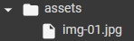

<div align="center">
  <h1>Image Grayscale Processor</h1>
  <h3>An image grayscale processor made in Python. 📸</h3>
  <br></br>
  <h4 align="left">
    Group assignment by students: Henrique Valiati Schroeder and Enzo Luigi Schork.
    <br></br>
  
  
  This algorithm has the function of converting a standard RGB image to a Grayscale image (gray levels), through the use of the Python programming language, and the    OpenCV and NumPy libraries.
  </h4>
  <br></br>
</div>

## How to run
To run this notebook, just download the .ipynb file and open it using Google Colab in your browser.

In addition, it is necessary to import the image to be converted. In this case, just click on the files icon in the left sidebar and create a new folder called "*assets*". Then, insert the desired image into the folder with the following name: "*img-01*".

 
<hr></hr>

# **Conversion of RGB image to Grayscale image**

- ## **Libraries installation**

The following libraries are installed:
1. OpenCV, for image processing.
2. NumPy, for working with large numerical computations.

The `cv2_imshow` method of the OpenCV library is also imported from the Google Colab Patches library, responsible for displaying the image, since the one from the original library causes errors in Google Colab.

```python
import cv2
import numpy as np
from google.colab.patches import cv2_imshow
```
<hr></hr>

- ## **Reading and displaying the image**

A variable called `img` is created. Through the `imread` method of the OpenCV library, this variable receives the value of the image to be manipulated, passing its directory. After that, the `imshow` method is used on this variable to display it.

```python
img = cv2.imread('./assets/img-01.jpg',1)
cv2_imshow(img)
```

</img>

<hr></hr>

- ## **Splitting arrays from each RGB value**

Three variables are created, `b` (blue), `g` (green) and `r` (red). Through the `split` method of the OpenCV library, each variable receives the value of a matrix corresponding to each color of the RGB coloring. That is, the variable `b` receives the matrices responsible for the blue coloring matrix of an image, and so on.

```python
B, G, R = cv2.split(img)
```
<hr></hr>

- ## **Image conversion and final result**

### There are two types of conversion:

1. **Basic Conversion Application:**

> First, a `img_grayscale_basic` variable is created. This variable receives the result of the following calculation: the value of the matrices responsible for each RGB coloring are added and in the end, the resulting value is divided by 3. After that, by the `array` method of the NumPy library, this same variable receives an array of the matrices resulting from the previous calculation and an 8-bit integer value type (`uint8`) is passed, assigning integers from 0 to 255.

```python
img_grayscale_basic = (B+G+R)/3
img_grayscale_basic = np.array(img_grayscale_basic, dtype=np.uint8)
```

After that, just use the `imshow` method of the OpenCV library to display the variable responsible for the already converted image.
```python
cv2_imshow(img_grayscale_basic)
```
</img>

2. **Application of pondered conversion**

> Each RGB color has a luminance percentage. This conversion takes this percentage into account, so it is called pondered. First, an `image_grayscale_pondered` variable is created. From the `array` method of the NumPy library, the variable receives an array of new matrices from the calculation performed with the RGB luminance proportions and passing an 8-bit integer value type (`uint8`), assigning integers of 0 to 255.

```python
img_grayscale_pondered = 0.299*B+0.587*G+0.114*R
img_grayscale_pondered = np.array(img_grayscale_pondered, dtype=np.uint8)
```

After that, just use the `imshow` method of the OpenCV library to display the variable responsible for the already converted image.
```python
cv2_imshow(img_grayscale_pondered)
```
</img>
